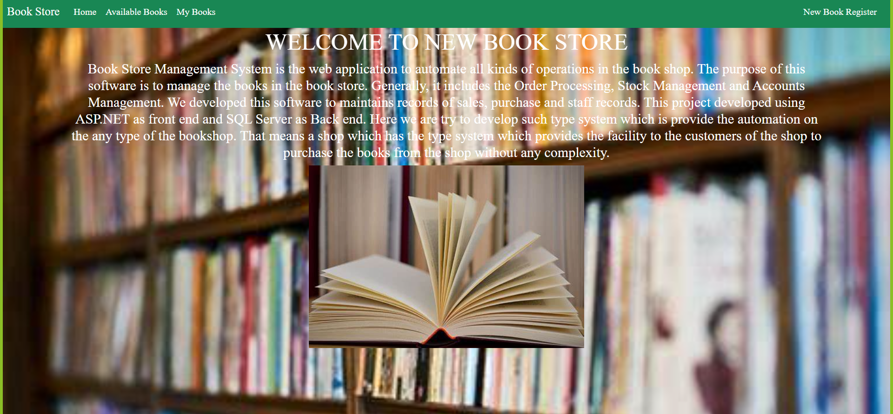

# BookStore using Servelets,JSP,MySql,HTML,CSS
# project-documentation

  

<h3 align="center">bookestore</h3>

---

  The purpose of this software is to manage the books in the book store. 
   Generally, it includes the Order Processing, Stock Management and Accounts Management. 
   We developed this software to maintains records of sales, purchase and staff records.
    This project developed using ASP.NET as front end and SQL Server as Back end. 
    Here we are try to develop such type system which is provide the automation on the any type of the bookshop. 
    That means a shop which has the type system which provides the facility to the customers of the shop to purchase the books from the shop without any complexity.
      

## 📝 Table of Contents
- [About](#about)
- [Getting Started](#getting_started)
- [Deployment](#deployment)
- [Usage](#usage)
- [Flow Chart](#flowchart)
- [TODO](../TODO.md)
- [Contributing](../CONTRIBUTING.md)
- [Authors](#authors)
- [Acknowledgments](#acknowledgement)

## 🧐 About 
Fully Functional E-commerce website bookestore is a responsive e-commerce website. The technologies used in this project are HTML, CSS, Vanilla JavaScript and Bootstrap. There are a few important modules in the project like home page, image carousel, book Registration page, my_booke page, Available books page etc. The data is accessed using ajax call and then rendered into the webpage using dynamic html template created using string literals. For Available books-page we are using localstorage to temporarily storing data before clicking on the checkout button. I took almost 40 - 50 hrs to complete this project. SkillLync helped me by providing the wire-frames for all relevant feature pages.

## 🏁 Getting Started 
These instructions will get you a copy of the project up and running on your local machine for development and testing purposes. See [deployment](#deployment) for notes on how to deploy the project on a live system.

### Prerequisites
What things you need to install the software and how to install them.

we have install spring boot,mysql,jsp,eclips,html,css.

### Installing
A step by step series of examples that tell you how to get a development env running.

Say what the step will be
https://start.spring.io/
https://www.eclipse.org/downloads/
https://start.spring.io/
https://dev.mysql.com/downloads/mysql/
https://www.htmlpad.net/download.php
Give the example

And repeat

until finished

End with an example of getting some data out of the system or using it for a little demo.

## 🔧 Running the tests 
Explain how to run the automated tests for this system.

### Break down into end to end tests
Explain what these tests test and why

Give an example

<<<<<<< HEAD
<!doctype html>
<html lang="en"xmlns:th="https://www.thymels.com">
  <head>
    
    <meta charset="utf-8">
    <meta name="viewport" content="width=device-width, initial-scale=1">
    <link href="https://cdn.jsdelivr.net/npm/bootstrap@5.0.2/dist/css/bootstrap.min.css" rel="stylesheet" integrity="sha384-EVSTQN3/azprG1Anm3QDgpJLIm9Nao0Yz1ztcQTwFspd3yD65VohhpuuCOmLASjC" crossorigin="anonymous">
<link rel="icon" type="image/png" href="https://cdn0.iconfinder.com/data/icons/shopping-solid-1/48/8-512.png" />
    <title>Book Store</title>
    
  </head>
  <body>
    
    <nav class="navbar navbar-expand-lg navbar-light bg-success">
  

    <a class="navbar-brand text-white" href="#">Book Store</a>
    <button class="navbar-toggler" type="button" data-bs-toggle="collapse" data-bs-target="#navbarSupportedContent" aria-controls="navbarSupportedContent" aria-expanded="false" aria-label="Toggle navigation">
      
    </button>
    

      <ul class="navbar-nav me-auto mb-2 mb-lg-0">
        <li class="nav-item">
          <a class="nav-link active text-white" aria-current="page" href="/home">Home</a>
        </li>
        <li class="nav-item">
          <a class="nav-link text-white" href="available_books">Available Books</a>
        </li>
         <li class="nav-item">
          <a class="nav-link text-white" href="myBooks">My Books</a>
        </li>
      </ul>
      

      <a class="nav-link text-white" href="book_register">New Book Register</a>
      

    

  

</nav>

   

   <h1 class="text-white">WELCOME TO NEW BOOK STORE</h1>
   <h4 class="text-white">Book Store Management System is the web application to automate all kinds of operations in the book shop. 
   The purpose of this software is to manage the books in the book store. 
   Generally, it includes the Order Processing, Stock Management and Accounts Management. 
   We developed this software to maintains records of sales, purchase and staff records.
    This project developed using ASP.NET as front end and SQL Server as Back end. 
    Here we are try to develop such type system which is provide the automation on the any type of the bookshop. 
    That means a shop which has the type system which provides the facility to the customers of the shop to purchase the books from the shop without any complexity.
    </h4>
    
   
 
    
    
    
    
   
  </body>
</html>

=======
>>>>>>> ccb3ef98e38119bc8d4d95dd9750ea018ced0479
## 🎈 Usage 
Add notes about how to use the system.

## 🚀 Deployment 
Add additional notes about how to deploy this on a live system.

## ⛏️ Flow Chart 

- [MongoDB](https://www.mongodb.com/) - Database
- [Express](https://expressjs.com/) - Server Framework
- [VueJs](https://vuejs.org/) - Web Framework
- [NodeJs](https://nodejs.org/en/) - Server Environment

## ✍️ Authors 
- [@SkillLymc](https://github.com/kylelobo) - FSD

See also the list of [contributors](https://github.com/kylelobo/The-Documentation-Compendium/contributors) who participated in this project.

## 🎉 Acknowledgements 
- Hat tip to anyone whose code was used
- Inspiration
- References
